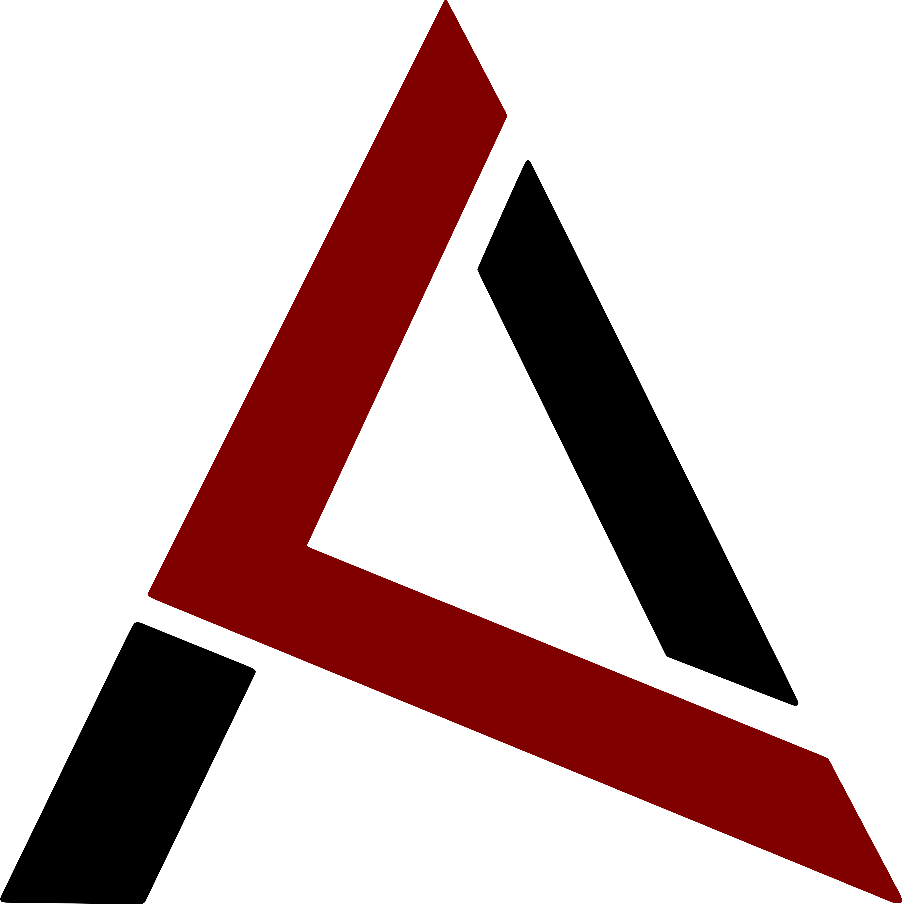

# LobsterPages

Project of a webpage covering the exploits and advances of the team the **Almighty Lobsters** through the [CanSat competition](http://www.esero.scientica.cz/cansat).
This being the front-end part of the project (as of *now*).

## Technologies used

* [React.js](https://facebook.github.io/react/)
* [React-router](https://github.com/ReactTraining/react-router)
* [Webpack](https://webpack.github.io/)
* [Babel](https://github.com/babel/babel)
* [Sass](http://sass-lang.com/)
* [ESLint](http://eslint.org/)

## How to run

`git clone https://github.com/AlmightyLobsters/LobsterPages.git` to clone repository  
`yarn` / `npm install` to install packages  
`yarn start` / `npm start` to spin up the hot-reloading webpack-dev-server  
*(you'll find it then on* [`http://localhost:8080/`](http://localhost:8080) *in your browser)*  
`yarn run build` / `npm run build` to build the project and get a static web page  

## TODOs

* [x] stack implemented
* [x] the whole thing designed
* [ ] back-end done
* [ ] site published
